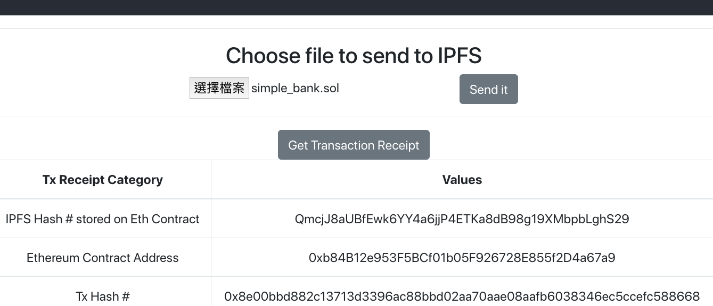

## 此為測試 ipfs + ethereum 以 react 為 ui 的 repo
## [build-a-simple-ethereum-interplanetary-file-system-ipfs-react-js-dapp](https://itnext.io/build-a-simple-ethereum-interplanetary-file-system-ipfs-react-js-dapp-23ff4914ce4e)

照我的理解，我玩的步驟應該是。
1. 先用 remix 部署一個 contract 上去
2. ipfs 已經指定好 node
3. 透過 (react) UI 來選檔案，傳到 ipfs 上面，這時候會拿到 ipfs hash
4. 把 ipfs 的 hash 透過 contract 的 sendHash 把 hash 存到 contract 裡面。

另外可以取回 txReceipt 來看。

